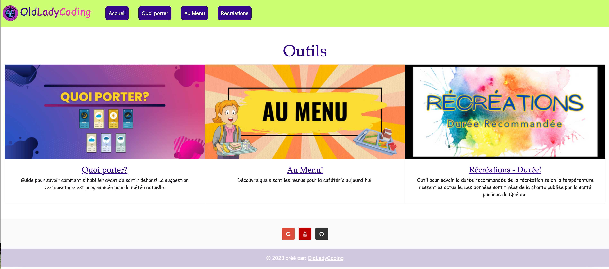
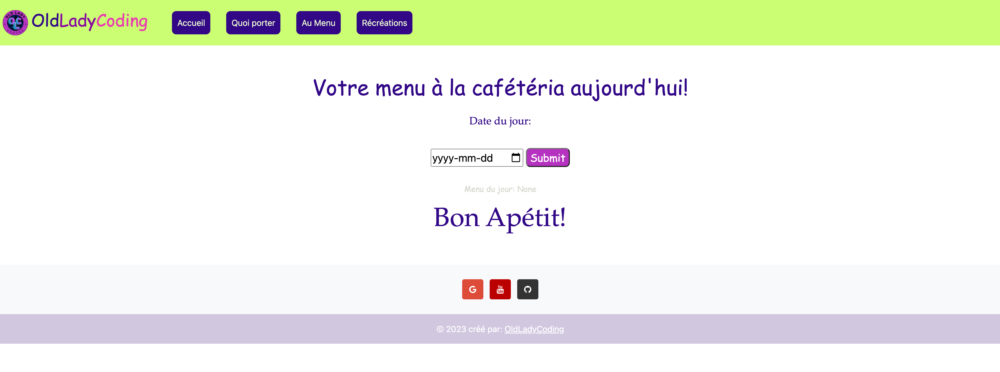
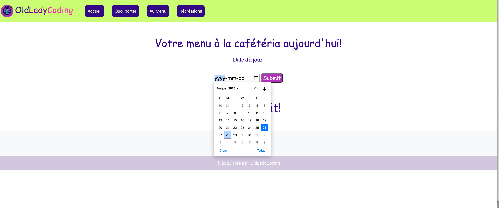
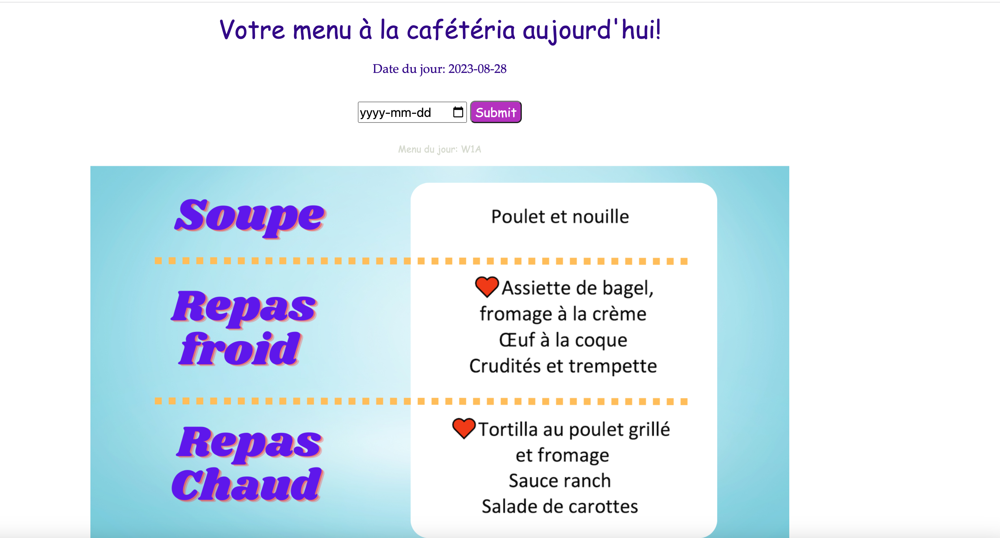
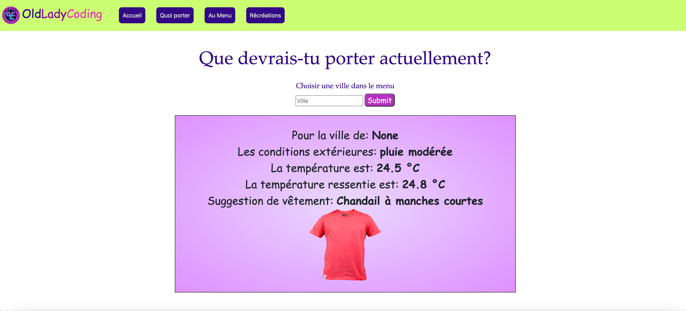
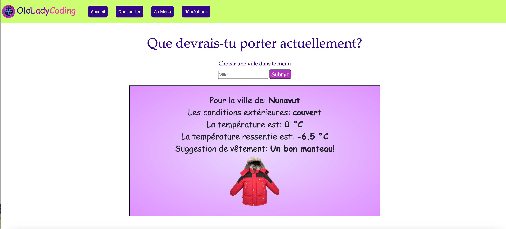

# school-tools

#### Video Demo: <https://youtu.be/Obc-4j8VTzQ>

## Description
School Tools is my CS50 final project. It is a collection of two tools aimed to help teachers in the school I teach at save time for morning routine and before each recess.

The cafeteria uses a roation of 5 weeks with different menus. Every morning, a count for the number of students who take meals from the cafeteria is done, most often by a student. Teh schedule is designed (on paper) to work with the use of "Week of sept. 8" for instance. As kids don't usually master their calendar skills until well over grade 5, it is regularly a time consuming enterprise to do this chore, as the teacher needs to intervene to help the student read the schedule properly.

The "menu" app allows to display the webpage on the interactive whiteboard, or any screen in the class, so that the student can use the calendar form (date picker) to choose today's date. When he submits the date, today's cafeteria menu appears on the screen, making it easier and faster for said student to do his/her job.

The second tool I designed is aimed at making it very visual for students, especially younger kids, to understand what they should be wearing to go outside for the different recess. Teachers usually had to take their phones out, or use any website with weather data, to check the actual weather so they could suggest appropriate clothing for students. My school is located in Canada, our weather varies tremendously throughout the school year. Some students had difficulty understanding that it may be colder in the early morning, even though it is sunny outside. This tool, I hope, will make the explanations more visual for students.

This web app will be expanded as the school year progresses and teacher may want to make requests for tools that could be added to it. An additional tool that is already in the process of being coded is similar to the weather/clothing app, but is aimed at givving quick information as per how long we can send the students outside depending on various weather factors such as windshield or humidity. The recommended durations in relation to temperature is data provided by Quebec's Ministry of health and schools have to follow that chart.

## Language
    This web application in in French.

## Code Style
I used the Flask framework to create an interactive web application. The pages themselves were coded in HTML. Styling used CSS and JavaScript (through Bootstrap).

## App Layout
    -Home
    -Quoi porter
    -Au Menu
    -Récréations

## Build Status
This project has two functionnal apps with a third planned for later on.
Bug: In the weather app, temperatures are shown before the user inputs a city.

## Installation
    1.Star and clone the repository to your machine.
    2.Run the command pip install -r requirements.txt
    3.Once all the dependancies have been installed, run the command flask run. It will run app.py. Make sure you are in the project directory.
    4.This should start a local server and you can access it on your browser.

## Usage (Screenshots)

    
    
    
    
    
    

## Files and directories
* `Project` - root application directory
    * `.templates` - contains all HTML files
    * `.static` - Contains CSS file and images
        * `weather` - contains images for the weather app
        * `menu` - contains images for the menu app
        * `models.py` - include all Django models I've used in this project which includes the
    * `.assets` - Contains screenshots for README file

## Credits
I used an API for the weather app:[Openweather's API website](https://openweathermap.org/)

Thanks to Tech with Tim [Tech with Tim youtube channel](https://www.youtube.com/@TechWithTim) for making awesome tutorials. You also gave me the building blocks to spark my idea.

## License

This project is under MIT license.
